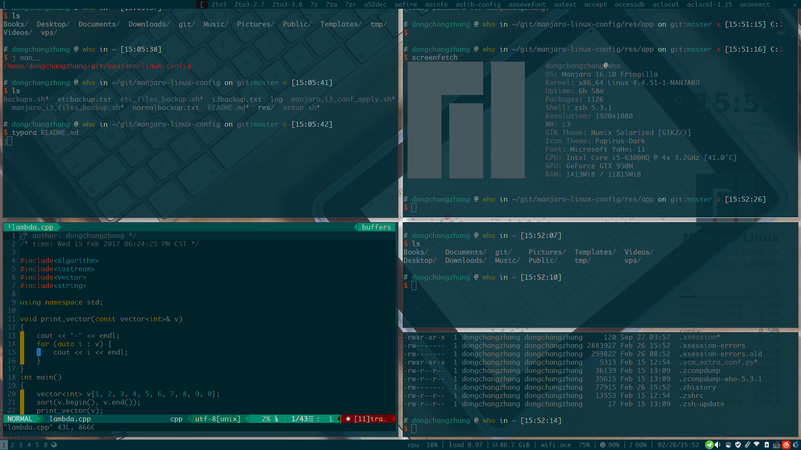

## manjaro linux configuration

manjaro linux是基于arch linux的一个发行版本，不仅保持了arch的kiss优点，而且拥有简单快捷的安装体验。你可以使用这个repo来使你的manjaro更加方便快捷。除此之外这里的vim、zsh、font、terminator等配置可以在任何linux发行版本上使用。因为我用manjaro-i3，在原有基础上我稍稍做了修改。喜欢我的i3的配置的可以直接使用。

### 功能概述

本repo包含软件自动安装的脚本、部分文件备份的脚本、vim、zsh、terminator、vscode等配置，monaco字体、monaco-yahei字体、以及一些常用的需要自己修改的etc配置

1. 对于新安装的manjaro linux，可以运行该脚本以配置pacman以及mirrors-list。更新并升级系统软件，安装常用的软件，安装monaco字体以及monaco-yahei字体以及powerline字体，配置vim、zsh以及vscode，配置git并且生成github需要的ssh-key
2. 对于其他用户以上各个功能已经被拆分，可以根据需要选择使用。
3. 根目录下的backups.sh用来备份用户目录，可以根据需要保留个人的配置。也可以使用这个脚本备份vim和zsh

### 项目结构

```
$ tree -L 2 
.
├── backups.sh # 备份home目录或仅仅备份vim和zsh
├── etcbackup.txt # etc目录的备份清单
├── etc_files_backup.sh # 备份etc文件到res/etc
├── i3backup.txt # i3的配置文件的备份清单
├── log # 操作的log
├── manjaro_i3_conf_apply.sh # 对于manjaro i3用户可以直接使用该脚本应用本repo的i3配置
├── manjaro_i3_files_backup.sh # manjaro i3配置文件的备份脚本
├── normalbackup.txt # 其他文件的备份清单
├── preview效果图
├── README.md 
├── res # 资源文件
│   ├── app # install.sh是安装app的脚本，在yaourt中的使用yaourt安装，pacman文件中的app使用pacman安装
│   ├── backgrounds # 几张背景图片
│   ├── backup # 当备份etc或i3配置文件，以前的配置将移动到这里以备不测
│   ├── code # vscode的配置文件
│   ├── etc # etc目录中的配置文件
│   ├── font # 字体
│   ├── i3 # i3配置文件
│   ├── ssh # 配置ssh 
│   ├── terminator # terminator
│   ├── vim # vim配置
│   └── zsh # zsh配置
└── setup.sh

12 directories, 10 files

```


### 怎样使用

克隆仓库到本地

```shell
git clone git@github.com:dongchangzhang/manjaro-linux-config.git
cd manjaro-linux-config
```

查看setup.sh支持的功能

```shell
chmod +x setup.sh
./setup.sh -q
```

选择你需要的功能运行

```
./setup.sh -选项1选项2...
```

注意：

根目录下的log文件记录了setup.sh的执行日志；res/app/log记录了安装的软件的日志；你可以到res/app/pacman以及yaourt文件中编辑你需要的软件，其中pacman文件使用pacman安装，yaourt中的使用yaourt命令安装

查看backups.sh支持的功能

```shell
chmod +x backups.sh
./backups.sh -q
```

选择你需要的功能

```shell
./backups.sh -选项1选项2...
```

注意：

备份home目录将生成backup.tar，该文件使用pigz进行打包压缩，由于pigz支持多线程可以提高压缩速度。解压时请保证backup.tar和脚本文件在同一个目录下。在备份home目录时将生成tar.sh这个脚本是将执行的备份命令，默认不备份非隐藏文件，在备份过程中你有机会使用vim编辑该文件来备份你需要的文件。

### 常用配置介绍

1. vim

   使用ycm实现自动补全。具体请查看vimrc

   

2. zsh

   4中是我的zsh配置效果，该配置是从网上找的自己加了一点，不知道出处。支持命令高亮等特性。

   另外zshrc末尾我将rm替换为了mv，每次rm文件时候将文件移动到~/.delete文件夹中相应日期的文件夹中以备不测

   其中：

   * lsdel查看.delete中的文件内容
   * cleandel清空.delete中的内容

3. terminator

   下图中使用的就是terminator

4. i3

   i3中建议使用terminator，否则urxvt中powerline中部分字体缺失。

   

   ​

5. etc

   除了保护pacman的配置文件之外，70-synaptics.conf是触控板的配置，实现单指实现左击双指右击，三指中建。需要将其复制到/etc/X11/xorg.conf.d/70.synaptics.conf

6. vscode