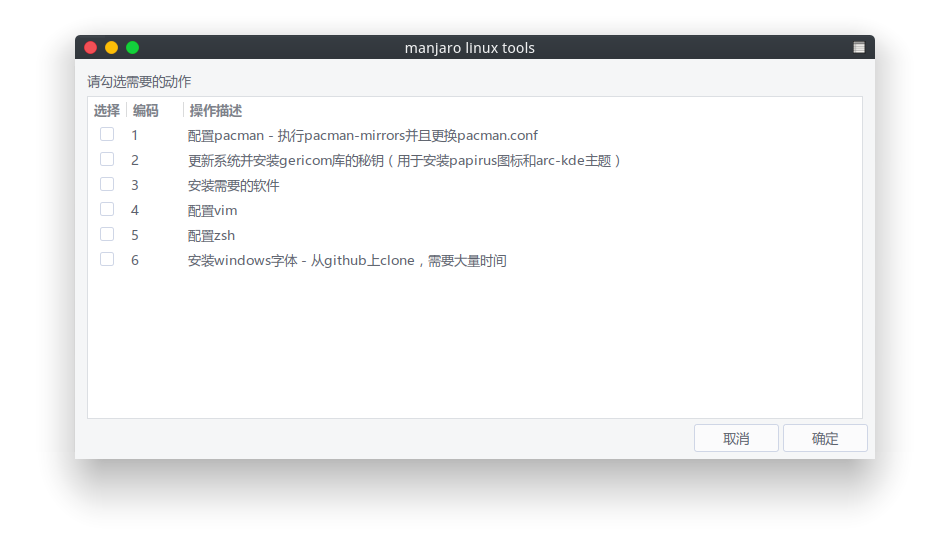
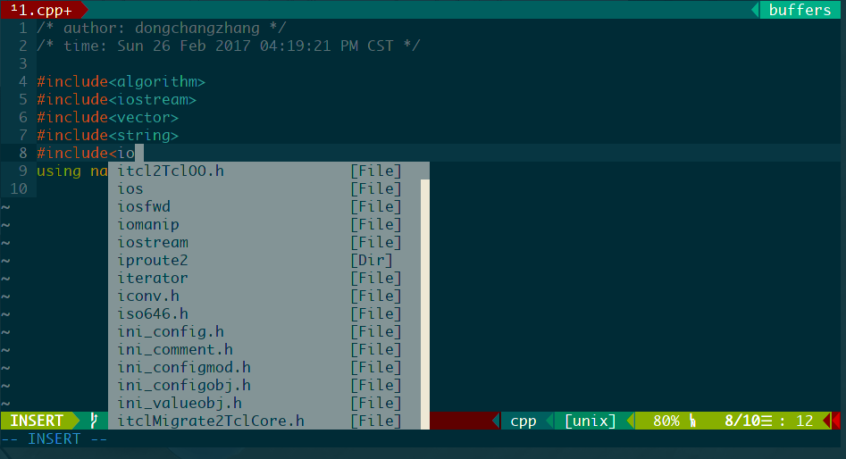

manjaro linux configuration

用于快速配置manjaro linux（常用软件，vim，zsh，pacman）

-> 怎样使用


```shell
# 克隆到本地
git clone git@github.com:dongchangzhang/manjaro-linux-config.git
cd manjaro-linux-config
```

方案1（图形界面）



方案2（命令行参数）

```shell
# 查看功能
chmod +x setup.sh
./setup.sh -q
------------------------------HELP------------------------------------
|-1  install applications                                            |
|-2  config zsh                                                      |
|-3  config vim                                                      |
|-4  visual studio code                                              |
|-5  ssh for github                                                  |
|-6  config etc files                                                |
|-7  config mirrors list                                             |
|-8  config i3wm for manjaro                                         |
|                                                                    |
|-A  do all for your system, if your system is new one               |
----------------------------------------------------------------------
bye
# 选择你需要的功能运行
./setup.sh -选项1选项2...
```

注意：

根目录下的log文件记录了setup.sh的执行日志；install.log记录了安装的软件的日志；你可以到res/app/pacman以及yaourt文件中编辑你需要的软件，其中pacman文件使用pacman安装，yaourt中的使用yaourt命令安装。另外，软件安装过程中无需确认，因此也无法终止，请反复确认文件中的软件列表是你所需要的。

查看backups.sh支持的功能

```shell
chmod +x backups.sh
./backups.sh -q
```

选择你需要的功能

```shell
./backups.sh -选项1选项2...
```

注意：

备份home目录将生成backup.tar，该文件使用pigz进行打包压缩，由于pigz支持多线程可以提高压缩速度。解压时请保证backup.tar和脚本文件在同一个目录下。在备份home目录时将生成tar.sh这个脚本是将执行的备份命令，默认不备份非隐藏文件，在备份过程中你有机会使用vim编辑该文件来备份你需要的文件。

-> vim


-> zsh

zshrc末尾我将rm替换为了mv，每次rm文件时候将文件移动到~/.delete文件夹中相应日期的文件夹中以备不测

其中：

* lsdel查看.delete中的文件内容
* cleandel清空.delete中的内容

-> pacman 

自动配置archlinuxcn